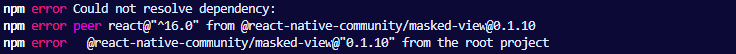
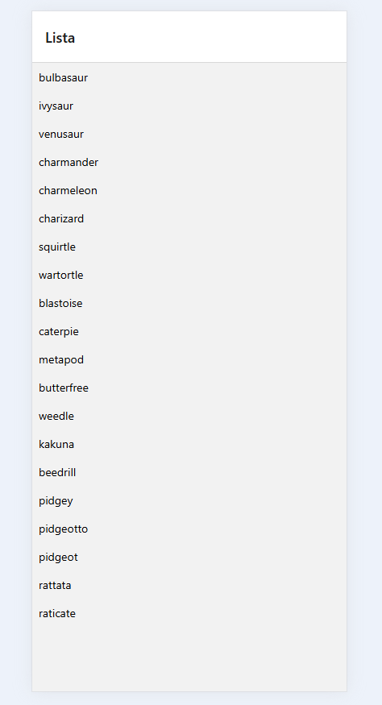
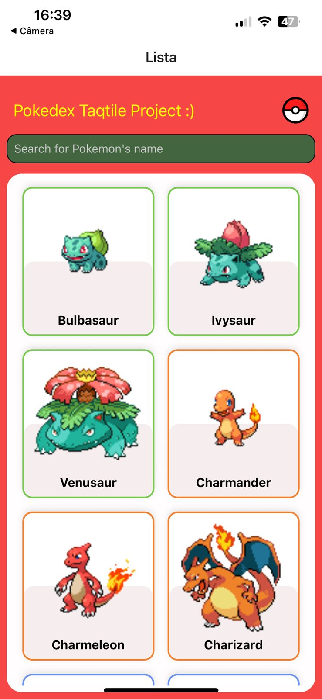
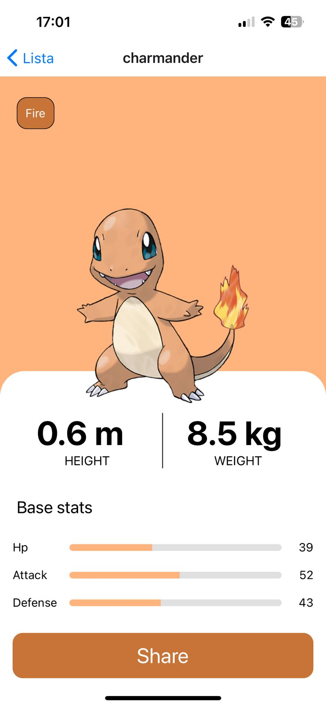

# Pokedex - Taqtile Challenge ~ Nicolas Mota

Document to explain the trajetory to implement __Taqtile Pokedex project__ .

---

## References
- [Flat List](https://reactnative.dev/docs/flatlist)
- [Styled Components](https://styled-components.com/docs/basics)
- [React Navigation](https://reactnavigation.org/docs/hello-react-navigation)
- [PokeApi Docs](https://pokeapi.co/docs/v2)
- [Share React Native](https://reactnative.dev/docs/share)


## Implementation
### Fixing Dependency Tree

When i first opened the project i found an error with the dependency tree. The version of the libraries wasn't matching. <br>
To fix it, i changed the __package.json__ to make versions compatible.

*Error example*<br>
<br>

After doing it, app runned correctly.

*App running*<br>
<br>

### Updating List component to use FlatList
FlatList is a component in react native used to render basic lists. In this case, where we are going to fetch a list of pokemons<br>
its a good option to use. I updated the List.js to use it.

*Excerpt of updated List.js code*
```javascript
    return (
    <View>
      {loading ? <ActivityIndicator size={'large'} /> : 
      <FlatList
        data={list} //pokemon list
        renderItem={({item}) => <PokemonItem name = {item.name}/>} //component to be render for each item in the list
      />
      }
    </View>
  );
```

### Implementing React Navigation
this step is quite simple, i just had to create a details.js component and change a bit the App.js to tell <br>
the application that details is a navigatable page, and then add a button in pokemon component that redirects the user<br>
to the details screen.<br>

*excerpt of App.js with details component line.*
```javascript

    <Stack.Navigator>
        
        <Stack.Screen name="Lista" component={List} />
        <Stack.Screen name="Details" component={Details}/>

    </Stack.Navigator>
```
*excerpt of list.js with PokemonItem updated.*
```javascript
    const PokemonItem = ({name, onPress}) =>
    { 
    
        return(
            <View>
                <Text>{name}</Text>
                <Button onPress={onPress} title='details'/>
            </View>
        )
    }
```

### Implementing PokeApi 

PokeApi is a "famous api" that returns pokemons data. Its very used ( at least i used for it ) by begginers to learn how to use APIs and fetch data. <br>
To implement it, first its necessary to know PokeApi endpoints that can be found in [PokeApi Docs](https://pokeapi.co/docs/v2).<br>  


| Method | Url | What Returns |
|:-----| :-------- |:-------|
| GET | https://pokeapi.co/api/v2/pokemon?limit=n/ | returns a list of the first n pokemons objects with name and an url <br> with the details of the pokemon |
| GET | https://pokeapi.co/api/v2/pokemon/{pokemon_name} | returns details of the pokemon related to 'pokemon_name' |

Actually, these will be the only two endpoints this project needs.  

#### Populating List Page 


Then, knowing the endpoints, its necessary to fetch the data to replace the mockList with the results incoming from the PokeApi.<br>
So, in the List.js components, we use the url that returns the 20( it means that i choose limit=20 ) pokemons list.

*excerpt of fetchData function in List.js*
```javascript
  async function fetchData()
  { 
     try {
      setLoading(true); 
      const response = await fetch('https://pokeapi.co/api/v2/pokemon?limit=20'); //get requisition to pokeApi that returns 20 pokemons
      const data = await response.json(); //takes the response in json format
      setList(data.results);  //fill the list array with the results field of the data object ( where the 20 pokemons (name and url) are)
    } catch (error) {
      console.error('Erro ao buscar Pokémon:', error);
    } finally {
      setLoading(false);
    }
    
  }
```
After changing the useState function and removing the mockList the component works correctly, now fetching the data from the api.

#### Populating Details Page 

In the details page, its necessary to fetch the pokemon data to display it in the page. 

*excerpt of fetchPokemonData function in Details.js*
```javascript
    async function fetchPokemonData(name) // function to get pokemon type to set card color
    {
        try {
            const response =  await fetch(`https://pokeapi.co/api/v2/pokemon/${name}`); //fetching pokemon data according to its name;
            const data = await response.json();
            setData(data); //set data state the response of the fetch;
        } catch (error) {
            console.error('Error on fetching type of pokemon:', error);
            return null;
        }
    }
```

After it, its just necessary to display the data like height, weight and base stats.

### Styling The Components

For Styling the components i used the Styled Components as asked in the TODO list. For the List component i tried to make it looks like a pokedex,    
so i choose a red color to paint the background of the wrapper in the list. Later i choose a style to make the pokemon cards. How is massive to tell  
steb by step what i dit i'll list some things that i found more important.

#### PokemonDisplay and FlatList Rows

So, i divided the list screen into a display area, where the pokemon's cards stay and an little area where i will put the title of the project and a  
search bar to filter the pokemons through their names. When i was doing it i find i problem with the number of columns, when i changed the screen width  
it started to look weird with small pokemons icons and just two columns in a huge amount of white space. This is a problem for tablet users, for example,
so i tried to make it more responsible. For it i used the dimensions interface of react native to get the width of the screen and than calculate the
number of columns of the FlatList.

```javascript
  const screenWidth = Dimensions.get('window').width;


  const CARD_WIDTH = 160 + 16; // width + margin
  const numColumns = Math.floor(screenWidth / CARD_WIDTH);

  <FlatList
    data={filteredList} 
    keyExtractor={(item) => item.name}
    renderItem={({item}) => 
      <PokemonItem 
          name = {item.name}
          onPress = {()=>navigation.navigate('Details', {name: item.name})}
          width={screenWidth / numColumns - 24}
      />
    }
    numColumns={numColumns} //<-- numColumns after calc
  />
```

#### Deciding Pokemon card colors

I wanted to make the card have some sign of what type the pokemon is, for it i create an array  
of colors in a file named colors.js that have one key attached to one color.

```javascript
  export const typeColors = {
    fire: '#ffb47eff',
    water: '#93b3ffff',
    grass: '#79d2b1dd',
    bug: '#b1ba5fff',
    normal: '#bcbc8fff',
    flying: '#a890f0',
    poison: '#ac90ffff'
  };
```

Than i added a fetch function in Pokemon component to get the type of each one and than change the border  
of the card.

```javascript
 async function fetchPokemonData(name) // function to get pokemon type to set card color
  {
    try {
      const response =  await fetch(`https://pokeapi.co/api/v2/pokemon/${name}`);
      const data = await response.json();
      const mainType = data.types[0]?.type.name || 'normal';
      const color = typeColors[mainType] || '#f67280';
      const imageUrl = data.sprites.front_default;
      setColor(color);
      setImageUrl(imageUrl);
    } catch (error) {
      console.error('Error on fetching type of pokemon:', error);
      return null;
    }
  }
  React.useEffect(()=>
  {
    fetchPokemonData(name);

  },[])

  //...

  <Pokemon onPress={onPress} style={{ borderColor: color }}> //setting border color
  //...
```

After configuring all styled-components the page looked like this:  

<br>


#### Details Screen

So, to the details screen i tried to follow the figma layout. It wasn't actually very hard, i used  
the colors array that i mentioned before to decide background color according to pokemon type. Also,  
with a fetch function a showed the data. The most different thing i think this screen have is the status  
bar that gets filled corresponding with the stats value.


*StatBar Component*
```javascript
const MAX_STAT = 100; //defines the max value a stat can have


const StatBar = ({statname,value,type}) =>
{
    const widthPercent = Math.min((value / MAX_STAT) * 100, 100); //gets the width of the filedbar by getting the percentage value/max_stat

     return (
        <StatRow>
            <StatLabel>{statname}</StatLabel>
            <BarContainer>
                <FilledBar style={{ width: `${widthPercent}%`,backgroundColor:typeColors[type]}} /> 
            </BarContainer>

            <StatValue>{value}</StatValue>
        </StatRow>
    );
}
```

*styled components of statsbar*
```javascript

const StatRow = styled(View)`
    flex-direction: row;
    align-items: center;
    margin-vertical: 8px;
`;

const StatLabel = styled(Text)`
    width: 60px;
    font-size: 14px;
`;

const BarContainer = styled(View)`
    flex: 1;
    height: 8px;
    background-color: #e0e0e0;
    border-radius: 4px;
    overflow: hidden;
    margin-horizontal: 8px;
`;

const FilledBar = styled(View)`
    height: 100%;
  
`;

const StatValue = styled(Text)`
    width: 30px;
    font-size: 14px;
    text-align: right;
`
```
With the styles implemented, the details page looked like this:  

<br>


#### About this section

Actually this is a very more visual step. Styling was a pretty fun and stressfull part of  
this project. I don't have so much to describe here because it's easier to just see.  
Using styled components, as a person that is used to use tailwind, is a very different experience  
but after all, it was really fun to learn it.

### Share button

The share button uses the Share component from React to abble user to share a pokemon data.
It's located in the details screen. When the user clicks the button it opens the share panel
of the cellphone, allowing him to share the pokemon stats in whatsapp, email, and other apps.


